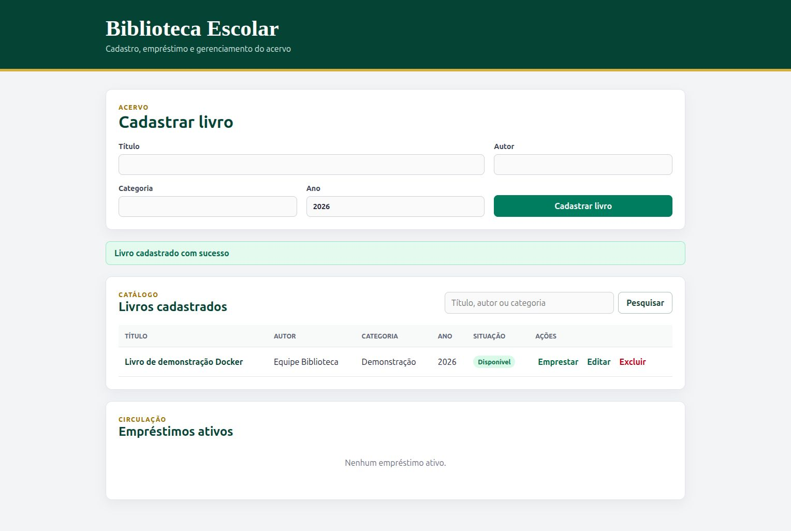

# Atividade GHCR: testes, build e validacao local

## Execucao realizada em 30/09/2026

A branch `develop` foi atualizada com `git pull --ff-only origin develop` antes das mudancas. Base: `03d5436`.

| Item da atividade | Evidencia local |
| --- | --- |
| 1. Conferir testes | 11 testes do backend e 2 do frontend aprovados em containers Node 22. Os testes de integracao usam PostgreSQL 15 separado e esquemas temporarios. |
| 3. Construir imagens | `biblioteca-backend:validacao` e `biblioteca-frontend:validacao` construidas com sucesso. |
| 4. Executar e validar | Frontend serviu a aplicacao; backend respondeu ao health check; cadastro, consulta, emprestimo, bloqueio de exclusao e devolucao foram validados contra os containers. Cadastro pela interface tambem confirmado. |

Durante a validacao, foi corrigido o build do backend: a compilacao gerava `dist/src/server.js`, enquanto `npm start` procurava `dist/server.js`. O build de producao agora inclui apenas `src`, com `rootDir: src`; a configuracao dos testes continua separada.

O `.dockerignore` do frontend foi movido para a raiz do contexto de build, excluindo dependencias, arquivos compilados e arquivos `.env` locais.



## Reproduzir no Linux

Pre-requisito: Docker Engine e Docker Compose. Nao e necessario instalar Node no computador: os testes usam Node 22 dentro dos containers.

Na raiz do repositorio, execute nesta ordem:

```bash
docker compose -f docker-compose.validacao.yml run --rm backend-tests
docker compose -f docker-compose.validacao.yml run --rm frontend-tests
docker compose -f docker-compose.validacao.yml build backend frontend
docker compose -f docker-compose.validacao.yml up -d banco backend frontend
python3 scripts/validar-containers.py
docker compose -f docker-compose.validacao.yml ps
```

- Aplicacao: http://localhost:13000
- API: http://localhost:18000/api/health
- As portas ficam acessiveis somente no computador local.
- O banco desse ambiente e descartavel e nao utiliza os volumes da aplicacao principal. As credenciais fixas do Compose sao somente para esse ambiente local de teste.
- Os arquivos de origem sao montados somente para leitura; as dependencias dos testes sao instaladas dentro dos containers temporarios.

Para encerrar:

```bash
docker compose -f docker-compose.validacao.yml down
```

Encerrar o container do banco apaga os dados temporarios. O script de validacao deve ser usado apenas com esse ambiente descartavel.

## Item 5: workflow para GHCR

O workflow `.github/workflows/cd-ci.yml` executa testes e Terraform antes do build. Depois de construir as imagens, inicia os containers e executa `scripts/validar-containers.py`. Uma falha nesses passos impede a publicacao.

Pushes normais na `develop` e na `main`, assim como pull requests, verificam o projeto sem publicar pacotes. A publicacao e acionada pelas tags `v1.0.0` e `v1.0.1`, enviadas pela equipe quando chegar aos itens 6 e 10. Cada tag publica as duas imagens com a versao correspondente:

```text
ghcr.io/kaua3030/sistema-biblioteca-backend:1.0.0
ghcr.io/kaua3030/sistema-biblioteca-frontend:1.0.0
```

A versao `1.0.1` recebe tags distintas, preservando `1.0.0`. A equipe deve criar cada tag somente uma vez, no commit escolhido da `develop`, e nao reutilizar uma versao ja publicada.

Tambem existe uma entrada manual com escolha da versao e da URL publica da API. A interface de execucao manual depende de o workflow com `workflow_dispatch` estar na branch padrao do repositorio. A publicacao pelas tags nao exige essa integracao previa.

A autenticacao utiliza `GITHUB_TOKEN` do Actions, com permissao `packages: write` no job de build/publicacao. O token e usado somente no login, sem ser passado para o Dockerfile.

O frontend e configurado no build. As tags usam por padrao `http://localhost:8000/api`, adequada para frontend e backend no mesmo computador; para outro endereco, ajuste o build antes de publicar ou utilize a entrada manual. A disponibilidade e a visibilidade dos pacotes devem ser conferidas pela equipe na primeira publicacao.

## Publicacao da versao 1.0.0

A tag [`v1.0.0`](https://github.com/kaua3030/sistema-biblioteca/tree/v1.0.0) aponta para o commit `38ed0f9` da `develop`. A [execucao do GitHub Actions](https://github.com/kaua3030/sistema-biblioteca/actions/runs/36774841835) terminou aprovada em 30/09/2026, apos testes, validacao Terraform, build e execucao das imagens. O log registra o push das duas imagens:

| Imagem no GHCR | Digest publicado |
| --- | --- |
| `ghcr.io/kaua3030/sistema-biblioteca-backend:1.0.0` | `sha256:1d5dff0c8b93ec48438f39c2d219f6fb3bd14bc35085f8a59b815b7f2e7f2424` |
| `ghcr.io/kaua3030/sistema-biblioteca-frontend:1.0.0` | `sha256:375511cb8e8024733b60abe2a80ef5de3a6be144c42c6a7e3b9007f48de6ce22` |

O download e a execucao das imagens a partir do GHCR, assim como a pequena alteracao e a versao `1.0.1`, continuam como proximos itens. A visibilidade dos pacotes para pessoas sem acesso ao repositorio ainda deve ser conferida.
